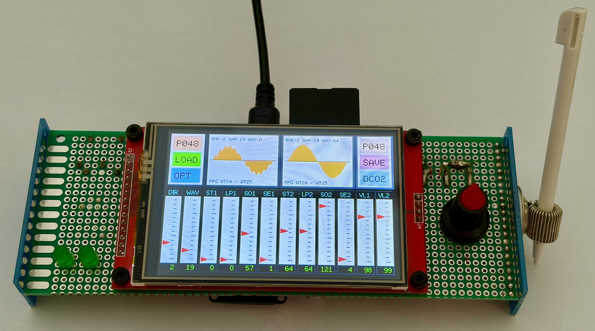
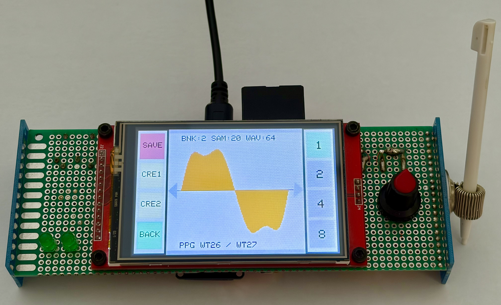
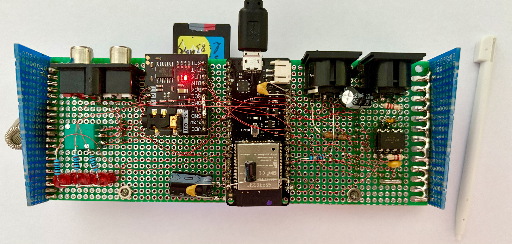

# WELLENFORMER

## Software-Defined Digital Wavetable Synthesizer

### Engineering Design Study

---

<p align="center">



</p>

<p align="center">

### Minimal Hardware. Maximum Sound Design.

**Designed by RealTimeAudioLab**

Engineering Heritage Collection

RTAL-EAI-001

</p>

---

# Overview

WELLENFORMER is a six-voice digital wavetable synthesizer developed as an independent engineering design study.

Rather than reproducing an existing commercial synthesizer, the project explores how a professional musical instrument can be realised using minimal hardware while maintaining excellent usability, low latency and high sound quality.

The synthesizer replaces the majority of traditional front-panel controls with a modern touchscreen and comprehensive MIDI implementation, significantly reducing hardware complexity while increasing flexibility.

---

# Engineering Design Study

Every RealTimeAudioLab project begins with a technical question.

For WELLENFORMER that question was:

> **Can a modern polyphonic wavetable synthesizer be implemented with minimal hardware while remaining intuitive, responsive and musically inspiring?**

The project therefore focuses on:

- Minimal hardware complexity
- Touch-based operation
- Complete MIDI control
- Professional sound quality
- Low latency
- Efficient DSP algorithms
- Software-defined user interface

Independent developments exploring innovative solutions in audio electronics, digital signal processing and embedded musical instruments.

---

# Main Features

| Feature | Description |
|-----------|-------------|
| Polyphony | 6 Voices |
| Oscillators | Dual Wavetable |
| Display | Touch TFT |
| Storage | SD Card |
| MIDI | Complete Implementation |
| DSP | Stereo Chorus, Delay, Reverb |
| Presets | Internal Program Memory |
| Interface | Fully Touch Operated |

---

# Why Touch?

One of the primary objectives of WELLENFORMER was reducing hardware complexity.

Instead of using dozens of potentiometers, switches and rotary encoders, the complete instrument is operated from a graphical touchscreen interface.

This approach offers several advantages:

- fewer components
- lower manufacturing cost
- easier assembly
- greater flexibility
- firmware-defined workflows
- future expandability

The touchscreen therefore becomes an integral part of the instrument architecture rather than simply replacing physical controls.

---

# Audio Engine

Each voice consists of:

• Dual wavetable oscillators

• Noise generator

• Digital mixer

• Resonant low-pass filter

• Envelope generator

• Stereo DSP routing

The architecture was designed for low latency and deterministic real-time performance.

---

# Integrated Wavetable Editor

Unlike many hardware synthesizers, WELLENFORMER includes a built-in graphical wavetable editor.

Waveforms can be drawn directly on the touchscreen.

The firmware automatically generates complete wavetable sets through interpolation and stores them on the SD card.

This allows sound design without requiring external software.

---

# MIDI

The instrument provides complete MIDI integration.

Supported functions include:

- Note On / Off
- Velocity
- Pitch Bend
- Modulation Wheel
- Program Change
- Control Change
- MIDI Clock Synchronisation

The complete MIDI implementation chart is included in the documentation.

---

# Gallery

## Front View

<p align="center">



</p>

---


## Wavetable Editor

<p align="center">


</p>
<p align="center">


</p>

---

## Hardware

<p align="center">



</p>

---

# Repository Structure

```text
WELLENFORMER/

README.md

firmware/

documentation/

hardware/

images/

videos/

midi/

presets/

wavetables/
